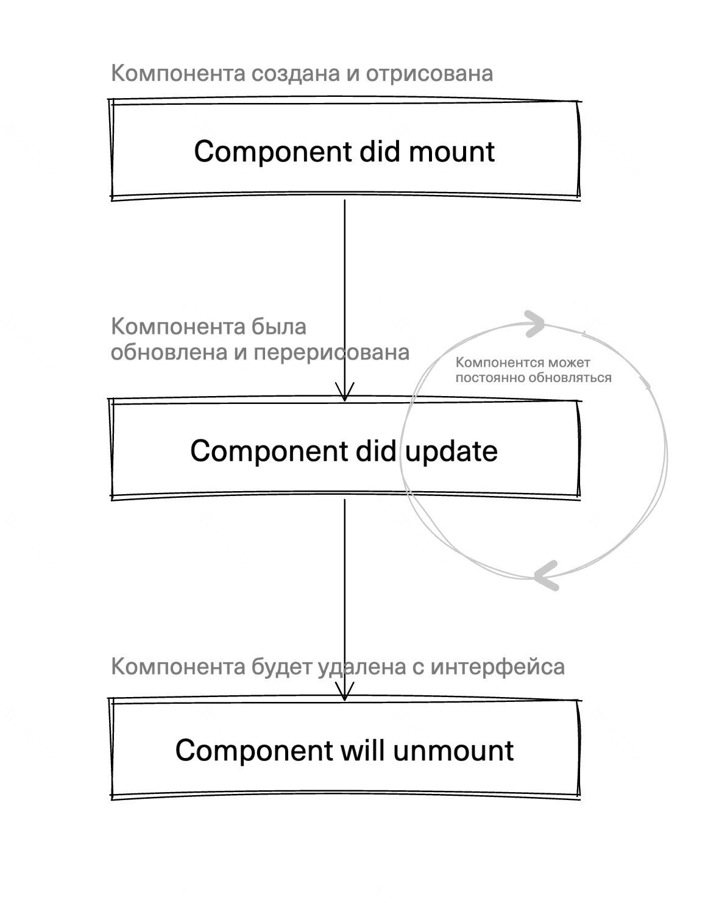

# Жизненный цикл React-компоненты

### Что такое жизненный цикл React-компоненты?
Жизненный цикл React-компоненты описывает этапы, через которые проходит компонента от момента eё создания до удаления из DOM-дерева.

Основные этапы жизненного цикла:
- *Component did mount* - происходит сразу после того как компонента отрисовалась в браузере 
- *Component did update* - происходит сразу после обновления компоненты
- *Component will unmount* - происходит перед удалениме компоненты


## Простая схема жизненного цикла компоненты


## Component did mount
Происходит сразу после отрисовки компоненты. Очень полезна для первого заполнения компоненты данными. Можно к этому этапу жизненного цикла привязать первое получение данных от апи или прочитать данные из ```localStorage```.

Для работы с ```component did mount``` необходимо использовать hook из React ```useEffect``` в конфигурации с пустым массивом во втором аргументе. Вот как это выглядит:

```jsx
import React, { useEffect } from "React";

function WeatherWidget() {
    // Работа с состояниями описана в 29-01-2025
    const [weatherValue, setWeatherValue] = useState();

    // Вызываем useEffect
    // в первый аргумент передаем функцию-обработчик
    // во второй аргумент пустой массив
    // в таком случае useEffect вызовется в момент component did mount
    useEffect(function() { // <~~~~ Первый аргумент это функция обработчик
        fetch("https://weather.api.com/spb/") // Такого адреса не существует, я его выдумал 👀
            .then(function(response) { 
                return response.json() 
            })
            .then(function(data) {
                setWeatherValue(data);
            });
    }, []); // <~~~~ Второй аргумент это пустой массив

    return (
        <div className="weatherWidget">
            <p className="weatherValue">{weatherValue}</p>
        </div>
    );
}

export default WeatherWidget;
```

В этом примере компонента отрисуется пустой, но сразу после своей отрисовки вызовется ```useEffect```, в котором будет обращение к апи погоды для получения данных о погоде. После получения данных о погоде будет заполнения состояния и виджет погоды будет показывать актуальную погоду.

Еще один пример, будем запускать таймер при появлении компоненты.

```jsx
import React, { useEffect } from "React";

function TimerComponent() {
    const [timer, setTimer] = useState();

    useEffect(function() {
        setInterval(function() {
            setTimer(function(value) { // <~~~~ value - это текущее состояние
                return value + 1; // <~~~~ возвращаем обновленное состояние
            })
        }, 1000);
    }, []);

    return (
        <div className="timerBlock">
            <p className="timer">{timer}</p>
        </div>
    );
}

export default TimerComponent;
```

## Compoentn did update
Этап жизненного цикла ```component did update``` вызывается:
- Сразу после ```component did mount```
- После каждого обновления внешних ```props``` компоненты
- После каждого обновления состояния компоненты

### Пример "Виратуальная клавиатура"

```Component did update``` происходит из-за обновления ```props``` компоненты

```jsx
import React, { useEffect, useState } from "react";

const RUS_LETTERS = [
    ["й", "ц", "у", "к", "е", "н", "г", "ш", "щ", "з", "х", "ъ"],
    ["ф", "ы", "в", "а", "п", "р", "о", "л", "д", "ж", "э"],
    ["я", "ч", "с", "м", "и", "т", "ь", "б", "ю"]
];

const ENG_LETTERS = [
    ["q", "w", "e", "r", "t", "y", "u", "i", "o", "p"],
    ["a", "s", "d", "f", "g", "h", "j", "k", "l"],
    ["z", "x", "c", "v", "b", "n", "m"]
];

// Компонента клавиатуры
// ожидает, что ей передадут 
// буквы через свойство "letters"
function VirtualKeyboard(props) {
    // Каждый раз, когда letters будут обновляться
    // будет происходить component did update
    // и будет вызываться useEffect приведенный ниже
    useEffect(function() {
        console.log('Letters updated!');
    }, [props.letters]) // <~~~ Массив зависимостей следит за letters

    return (
        <div className="keyboardLayout">
            {props.letters.map((row, i) => 
                <div className="keyboardRow" key={i}>
                    {row.map((letter) => 
                        <button className="letterKey" key={letter}>
                            {letter}
                        </button>
                    )}
                </div>
            )}
        </div>
    )
}

function Screen() {
    const [keyboardLettesr, setKeyboardLetters] = useState(RUS_LETTERS);

    function changeLang() {
        setKeyboardLetters(function(currentLang) {
            return currentLang === RUS_LETTERS ? ENG_LETTERS : RUS_LETTERS;
        });
    }

    return (
        <div className="screen">
            <button onClick={changeLang}>ru/en</button>

            {/* Каждый раз, когда будет обновление keyboardLetters, 
                внутри VirtualKeyboard будет происходить component did update */}
            <VirtualKeyboard letters={keyboardLettesr} />
        </div>
    )
}

export default Screen;
```

### Пример - переключение темы "светлая/темная"
```Component did update``` происходит из-за обновления ```состояния``` компоненты
```jsx
import React, { useState, useEffect } from "react";

function ThemeToggler() {
    const [theme, setTheme] = useState("light");

    // В данном случае обработка 
    // component did update будет 
    // происходить из-за обновления 
    // внутреннего состояния компоненты
    useEffect(function() {
        console.log('THEME CHANGED');
    }, [theme]) // <~~~ Массив зависимостей следит за внутренним состоянием

    function toggleTheme() {
        setTheme(function(currentTheme) {
            return currentTheme === "light" ? "dark" : "light";
        });
    }

    return (
        <button onClick={toggleTheme}>
            Current theme: {theme}
        </button>
    )
}

export default ThemeToggler;
```

## Component will unmount
```component will unmount``` происходит перед самым исчезновением компоненты с интерфейса. Обработать это событие жизненного цикла очень просто. Функция, которая передается в ```useEffect``` должна вернуть другую функцию, которая и будет вызываться во время ```component will unmount```


### Пример появление/исчезновение Loader

```jsx
import React, { useState, useEffect } from "react";

function Loader() {
    useEffect(function() {
        console.log("LOADER MOUNTED");

        return function() { // <~~~ Component will unmount
            console.log("UNMOUNTING");
        }
    }, [])

    return (
        <div className="awesomeLoader"></div>
    )
}

function TodoList() {
    const [loading, setLoading] = useState(true);

    useEffect(function() {
        setTimeout(function() {
            // Отключаем Loader
            // Для Loader сработает Component will unmount
            setLoading(false); 
        }, 1000)
    }, [])

    return (
        <div>
            {loading && <Loader />}
        </div>
    )
}

export default TodoList;
```

# Памятка функций жизненного цикла React-компонент

```jsx
// Первая отрисовка
// Component did mount
useEffect(function() {

}, []) // <~~~ Пустой массив зависимостей


// Перерисовка компоненты
// Component did update
useEffect(function() {

}, [anyProps, anyState]) // <~~~ Массив зависимостей заполнен темы
                         // свойствами и состояниями при обновлении 
                         // которых необходимо обработать Component did update


// Компоненты будет удалена с интерфейса
// Component will unmount
useEffect(function() {
    return function() { // <~~~ Функция, которая вызовется 
                        // перед удалением компоненты
    }
}, []) // <~~~ Пустой массив зависимостей


// useEffect можно использовать хоть сколько раз внутри одной компоненты
```
